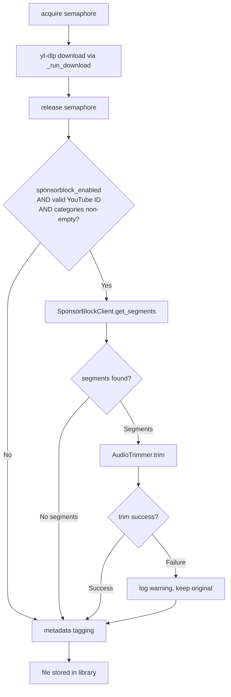

# Design Document: SponsorBlock Integration

## Overview

This feature integrates the [SponsorBlock](https://sponsor.ajay.app/) community database into InSync's audio download pipeline. After yt-dlp downloads a track, InSync queries the SponsorBlock public API for timestamped segments associated with the YouTube video ID, then uses FFmpeg to cut those segments out of the audio file before metadata tagging and storage.

The integration is opt-in (disabled by default) and configurable per segment category. When disabled, the existing download pipeline is completely unchanged.

### Key Design Decisions

**Two new service modules, not modifications to `DownloadService`**: `SponsorBlockClient` (HTTP lookup) and `AudioTrimmer` (FFmpeg segment removal) are implemented as separate, independently testable services. `DownloadService._download` is restructured to call them after releasing the semaphore. This keeps each component focused and testable in isolation.

**Settings-only configuration**: SponsorBlock settings live in `app/config.py` alongside all other settings. No database-backed `AppConfig` entries are needed — these are deployment-time choices, not per-user runtime preferences.

**Graceful degradation**: Any failure in SponsorBlock lookup or audio trimming is non-fatal. The pipeline logs the failure and continues with the untrimmed file, ensuring a download failure in SponsorBlock never causes a track to be lost.

**FFmpeg stream copy**: Trimming uses `-c copy` (no re-encoding) to preserve the original codec and quality. The filter_complex approach with `select`/`aselect` filters constructs the keep-regions from the inverse of the removed segments.

**SponsorBlock runs outside the concurrency semaphore**: The existing `_semaphore` gates yt-dlp downloads to avoid hammering YouTube. SponsorBlock processing (an HTTP lookup against a different host + a local FFmpeg subprocess) does not need this gate — it operates on a file already on disk and has no contention with other downloads. Restructuring `_download` to release the semaphore immediately after `_run_download` returns, then calling `_apply_sponsorblock` outside the `async with` block, means all in-flight downloads can process SponsorBlock concurrently without blocking new yt-dlp slots. Each download operates on its own unique file path, so there is no shared mutable state between concurrent `_apply_sponsorblock` calls.

---

## Architecture



The semaphore is released immediately after `_run_download` returns, before any SponsorBlock work begins. This means:
- All concurrent downloads can run SponsorBlock processing in parallel without blocking new yt-dlp slots.
- Each `_apply_sponsorblock` call operates on its own unique file path — no shared mutable state, no locking needed.

The two new services are instantiated once at application startup (in `app/state.py`) and injected into `DownloadService`, following the same pattern used for `JellyfinClient`.

---

## Components and Interfaces

### `SponsorBlockClient` (`backend/app/services/sponsorblock.py`)

Responsible for querying the SponsorBlock public API and returning parsed segment data.

```python
from dataclasses import dataclass

@dataclass(frozen=True, slots=True)
class SponsorSegment:
    start: float   # seconds
    end: float     # seconds
    category: str

class SponsorBlockClient:
    BASE_URL = "https://sponsor.ajay.app/api/skipSegments"
    TIMEOUT = 10.0  # seconds

    def __init__(self, categories: list[str]) -> None:
        """categories: list of SponsorBlock category strings to request."""
        ...

    async def get_segments(self, video_id: str) -> list[SponsorSegment]:
        """Query the SponsorBlock API for the given YouTube video ID.

        Returns an empty list if:
        - video_id is not a valid YouTube video ID (11-char alphanumeric)
        - API returns 404 (no community data)
        - API returns any other HTTP error (logs warning)
        - Request times out (logs warning)
        """
        ...
```

**YouTube video ID validation**: Uses the same `_YOUTUBE_VIDEO_ID_RE = re.compile(r"^[a-zA-Z0-9_-]{11}$")` pattern already present in `download.py`. The client validates the ID before making any HTTP request.

**HTTP client**: Uses `httpx.AsyncClient` with a 10-second timeout. A new client is created per request (consistent with `JellyfinClient` pattern).

**API parameters**: Sends `videoID=<id>` and `categories=["sponsor","intro",...]` as query parameters. The categories list is JSON-encoded as required by the SponsorBlock API.

**Response parsing**: On HTTP 200, parses the JSON array. Each element has a `"segment"` key containing `[start, end]` floats and a `"category"` key. On HTTP 404, returns `[]`. On any other HTTP error or timeout, logs a warning and returns `[]`.

---

### `AudioTrimmer` (`backend/app/services/audio_trimmer.py`)

Responsible for removing segments from an audio file using FFmpeg.

```python
from dataclasses import dataclass
from pathlib import Path

@dataclass(frozen=True, slots=True)
class TrimSegment:
    start: float
    end: float

class AudioTrimmer:
    def __init__(self, ffmpeg_path: str = "ffmpeg") -> None:
        ...

    def trim(self, audio_path: Path, segments: list[TrimSegment], duration: float) -> bool:
        """Remove the given segments from audio_path in-place.

        - Merges overlapping segments before processing.
        - If segments is empty, returns True immediately (no-op).
        - If merged segments cover the entire file, logs a warning and returns True (no-op).
        - Uses FFmpeg with -c copy (no re-encoding).
        - On FFmpeg failure, logs error, discards partial output, returns False.
        - On success, overwrites audio_path with the trimmed output.

        Returns True if the file was processed successfully (or was a no-op),
        False if FFmpeg failed.
        """
        ...

    @staticmethod
    def merge_overlapping(segments: list[TrimSegment]) -> list[TrimSegment]:
        """Merge overlapping or adjacent segments into a minimal non-overlapping list.

        Returns segments sorted by start time with all overlaps resolved.
        """
        ...
```

**FFmpeg command construction**: The trimmer builds a `filter_complex` that selects the audio regions to *keep* (the inverse of the segments to remove). For example, if a 300-second file has segments `[10, 30]` and `[60, 90]`, the keep regions are `[0, 10]`, `[30, 60]`, `[90, 300]`. These are expressed as `aselect` filter expressions and concatenated with `aconcatenate`.

**Temp file strategy**: FFmpeg writes to a `.tmp` file alongside the original. On success, the temp file replaces the original via `Path.replace()`. On failure, the temp file is deleted and the original is untouched.

**`duration` parameter**: The caller (pipeline integration) obtains the audio duration via `mutagen.File(path).info.length` before calling `trim`. This is needed to detect full-coverage segments and to construct the final keep region.

**Synchronous execution**: `trim` is a synchronous method (FFmpeg is a subprocess). The pipeline calls it via `asyncio.to_thread` to avoid blocking the event loop, consistent with how `_run_download` already uses `asyncio.to_thread`.

---

### Settings additions (`backend/app/config.py`)

```python
sponsorblock_enabled: bool = False
sponsorblock_categories: str = "sponsor,intro,outro,selfpromo"
```

A `@computed_field` or validator parses `sponsorblock_categories` into a `list[str]` and validates each entry against the known set: `{"sponsor", "intro", "outro", "selfpromo", "interaction", "music_offtopic", "filler"}`.

```python
VALID_SPONSORBLOCK_CATEGORIES = frozenset({
    "sponsor", "intro", "outro", "selfpromo",
    "interaction", "music_offtopic", "filler",
})

@computed_field
@property
def sponsorblock_category_list(self) -> list[str]:
    """Parsed and validated list of SponsorBlock categories."""
    ...
```

If any category in the comma-separated string is not in `VALID_SPONSORBLOCK_CATEGORIES`, pydantic raises a `ValidationError` at startup.

---

### Pipeline integration (`backend/app/services/download.py`)

`DownloadService` gains two optional constructor parameters:

```python
class DownloadService:
    def __init__(
        self,
        music_dir: Path,
        concurrency: int,
        audio_config: AudioConfig | None = None,
        sponsorblock_client: SponsorBlockClient | None = None,
        audio_trimmer: AudioTrimmer | None = None,
    ) -> None:
        ...
```

The key structural change is in `_download`: the semaphore is released immediately after `_run_download` returns, and `_apply_sponsorblock` is called **outside** the `async with self._semaphore` block:

```python
async def _download(self, request, task_id, on_downloading):
    async with self._semaphore:
        if on_downloading is not None:
            await on_downloading(task_id)
        # yt-dlp download — semaphore held here
        path = await asyncio.to_thread(self._run_download, request)
    # semaphore released — SponsorBlock runs in parallel with other downloads
    if path is not None and self._sponsorblock_client is not None and self._audio_trimmer is not None:
        await self._apply_sponsorblock(path, request.source_id)
    return DownloadResult(request=request, path=path, error=None)
```

This means all in-flight downloads process SponsorBlock concurrently without consuming a yt-dlp concurrency slot. Since each download writes to a unique file path, there is no shared mutable state between concurrent `_apply_sponsorblock` calls — no additional locking is required.

The `_apply_sponsorblock` method:
1. Validates `source_id` is a YouTube video ID (delegates to `SponsorBlockClient.get_segments` which already validates).
2. Calls `await self._sponsorblock_client.get_segments(source_id)`.
3. If segments are returned, gets audio duration via mutagen, calls `await asyncio.to_thread(self._audio_trimmer.trim, path, segments, duration)`.
4. Logs appropriately at each step.
5. Catches all exceptions, logs at WARNING level, and continues.

**Disk-cached tracks are excluded**: The early-return path in `_run_download` (when `path.is_file()` already exists) calls `_tag_from_request_only` and returns before reaching the SponsorBlock step. Since `_run_download` returns the path in both cases, the caller must check whether the file was freshly downloaded or already existed. A boolean flag or sentinel return value distinguishes the two cases so `_apply_sponsorblock` is only called for fresh downloads.

---

### Application wiring (`backend/app/state.py`)

At startup, `AppState` reads settings and conditionally constructs the SponsorBlock services:

```python
settings = get_settings()

sponsorblock_client = None
audio_trimmer = None
if settings.sponsorblock_enabled and settings.sponsorblock_category_list:
    sponsorblock_client = SponsorBlockClient(categories=settings.sponsorblock_category_list)
    audio_trimmer = AudioTrimmer()

download_service = DownloadService(
    music_dir=settings.music_dir,
    concurrency=settings.download_concurrency,
    audio_config=AudioConfig(format=settings.audio_format, quality=settings.audio_quality),
    sponsorblock_client=sponsorblock_client,
    audio_trimmer=audio_trimmer,
)
```

---

## Data Models

No new database tables or Alembic migrations are required. SponsorBlock processing is a stateless pipeline step — segments are fetched, applied, and discarded. The `Track` model and `DownloadTask` model are unchanged.

The only persistent state change is the audio file on disk (trimmed in-place), which is already tracked by `Track.file_path`.

---

## Correctness Properties

*A property is a characteristic or behavior that should hold true across all valid executions of a system — essentially, a formal statement about what the system should do. Properties serve as the bridge between human-readable specifications and machine-verifiable correctness guarantees.*

### Property 1: SponsorBlock lookup is called for every valid YouTube ID when enabled

*For any* valid YouTube video ID (11-character alphanumeric string), when `sponsorblock_enabled` is `True` and categories are non-empty, the SponsorBlock client's `get_segments` method SHALL be called with that video ID during the download pipeline.

**Validates: Requirements 1.3, 5.4**

---

### Property 2: API request categories match configured categories exactly

*For any* non-empty subset of valid SponsorBlock category names, when the client queries the API, the HTTP request SHALL contain exactly those category values — no more, no fewer.

**Validates: Requirements 2.3, 3.1**

---

### Property 3: Settings validation rejects invalid category names

*For any* string that is not one of the seven recognised SponsorBlock category values (`sponsor`, `intro`, `outro`, `selfpromo`, `interaction`, `music_offtopic`, `filler`), constructing `Settings` with that string in `SPONSORBLOCK_CATEGORIES` SHALL raise a `ValidationError`.

**Validates: Requirements 2.5**

---

### Property 4: API response parsing round-trip

*For any* list of `(start, end, category)` triples representing valid SponsorBlock segments, serialising them to the SponsorBlock API JSON format and parsing the response SHALL produce `SponsorSegment` objects with identical `start`, `end`, and `category` values.

**Validates: Requirements 3.2**

---

### Property 5: Non-404 HTTP errors always return empty segment list

*For any* HTTP error status code other than 404 (e.g., 400, 429, 500, 503), the `SponsorBlockClient` SHALL return an empty segment list without raising an exception.

**Validates: Requirements 3.4**

---

### Property 6: Invalid YouTube IDs never trigger an HTTP request

*For any* string that does not match the YouTube video ID format (11-character `[a-zA-Z0-9_-]`), calling `SponsorBlockClient.get_segments` SHALL return an empty list without making any HTTP request.

**Validates: Requirements 3.6, 5.4**

---

### Property 7: Segment merging produces non-overlapping intervals with identical coverage

*For any* list of `(start, end)` intervals (including overlapping, adjacent, and nested ones), `AudioTrimmer.merge_overlapping` SHALL return a list of non-overlapping intervals sorted by start time that covers exactly the same set of time points as the input.

**Validates: Requirements 4.6**

---

### Property 8: Trimming always uses stream copy (no re-encoding)

*For any* non-empty list of valid segments, the FFmpeg command constructed by `AudioTrimmer.trim` SHALL include `-c copy` (or equivalent `-acodec copy`) to prevent re-encoding.

**Validates: Requirements 4.3**

---

### Property 9: Pipeline resilience — SponsorBlock failures never fail the download task

*For any* exception type raised by `SponsorBlockClient.get_segments` or `AudioTrimmer.trim`, the download pipeline SHALL complete successfully, mark the task as `completed`, and still invoke metadata tagging on the (untrimmed) file.

**Validates: Requirements 5.2, 6.4**

---

### Property 10: Trimming info log contains video ID, segment count, and total duration

*For any* non-empty list of segments applied to a track, the INFO log entry emitted by the pipeline SHALL contain the YouTube video ID, the number of segments removed, and the total duration removed (in seconds).

**Validates: Requirements 6.1**

---

## Error Handling

| Failure scenario | Behaviour |
|---|---|
| SponsorBlock API returns 404 | Return `[]`; log at DEBUG; pipeline continues normally |
| SponsorBlock API returns other HTTP error | Return `[]`; log WARNING with status code; pipeline continues |
| SponsorBlock API request times out (>10 s) | Return `[]`; log WARNING; pipeline continues |
| SponsorBlock API returns malformed JSON | Catch `ValueError`/`KeyError`; log WARNING; return `[]`; pipeline continues |
| FFmpeg exits non-zero | Log ERROR; delete temp file; keep original; `trim` returns `False`; pipeline continues with untrimmed file |
| FFmpeg not found on PATH | Catch `FileNotFoundError`; log ERROR; `trim` returns `False`; pipeline continues |
| Segments cover entire file | Log WARNING; skip trimming; `trim` returns `True` (no-op); pipeline continues |
| `mutagen` cannot read duration | Log WARNING; skip trimming; pipeline continues |
| `sponsorblock_enabled=False` | No SponsorBlock code runs; no log entries emitted |
| `sponsorblock_categories` empty | No SponsorBlock code runs; no log entries emitted |

All SponsorBlock-related failures are non-fatal. The download task is always marked `completed` (not `failed`) when the underlying yt-dlp download succeeded, regardless of SponsorBlock outcome.

---

## Testing Strategy

### Unit tests (`backend/tests/test_sponsorblock.py`, `test_audio_trimmer.py`)

Unit tests cover specific examples and edge cases:

- `SponsorBlockClient` with mocked `httpx`:
  - HTTP 200 with a known response body → correct `SponsorSegment` list
  - HTTP 404 → empty list
  - HTTP 500 → empty list, warning logged
  - Timeout → empty list, warning logged
  - Invalid video ID (wrong length, invalid chars) → empty list, no HTTP call
- `AudioTrimmer.merge_overlapping`:
  - Empty list → empty list
  - Single segment → unchanged
  - Two non-overlapping segments → both preserved, sorted
  - Two overlapping segments → merged into one
  - Nested segments → merged into outer
  - Adjacent segments (end == start) → merged
- `AudioTrimmer.trim` with mocked `subprocess.run`:
  - Empty segments → no-op, returns `True`
  - Full-coverage segments → no-op, warning logged, returns `True`
  - FFmpeg success → original file overwritten
  - FFmpeg non-zero exit → original file retained, temp file deleted, returns `False`
- Settings validation:
  - Default values
  - Valid `SPONSORBLOCK_CATEGORIES` env var
  - Invalid category name → `ValidationError`
  - Empty categories string → empty list

### Property-based tests (`backend/tests/test_sponsorblock_properties.py`)

Uses [Hypothesis](https://hypothesis.readthedocs.io/) (already a dev dependency). Each test runs a minimum of 100 iterations.

**Property 1** — `test_sponsorblock_called_for_valid_youtube_ids`
Generate random valid YouTube video IDs (11-char `[a-zA-Z0-9_-]`), mock `SponsorBlockClient.get_segments`, run `_apply_sponsorblock`, assert client was called with the ID.
Tag: `Feature: sponsorblock-integration, Property 1`

**Property 2** — `test_api_request_categories_match_configured`
Generate random non-empty subsets of valid categories, mock `httpx.AsyncClient`, call `SponsorBlockClient.get_segments`, assert the `categories` query parameter matches the configured list.
Tag: `Feature: sponsorblock-integration, Property 2`

**Property 3** — `test_settings_rejects_invalid_categories`
Generate random strings not in the valid category set, attempt to construct `Settings` with `SPONSORBLOCK_CATEGORIES=<invalid>`, assert `ValidationError` is raised.
Tag: `Feature: sponsorblock-integration, Property 3`

**Property 4** — `test_api_response_parsing_round_trip`
Generate random lists of `(start, end, category)` triples, serialise to SponsorBlock API JSON format, mock HTTP 200 response, call `get_segments`, assert parsed output matches input.
Tag: `Feature: sponsorblock-integration, Property 4`

**Property 5** — `test_non_404_errors_return_empty_list`
Generate random HTTP error codes from `{400, 401, 403, 429, 500, 502, 503}`, mock `httpx` response, call `get_segments`, assert empty list returned.
Tag: `Feature: sponsorblock-integration, Property 5`

**Property 6** — `test_invalid_youtube_ids_no_http_request`
Generate random strings that don't match `^[a-zA-Z0-9_-]{11}$` (wrong length or invalid chars), mock `httpx`, call `get_segments`, assert no HTTP request was made and empty list returned.
Tag: `Feature: sponsorblock-integration, Property 6`

**Property 7** — `test_merge_overlapping_produces_valid_intervals`
Generate random lists of `(start, end)` pairs (with `start < end`, floats in `[0, 3600]`), call `merge_overlapping`, assert:
- Result is sorted by start time
- No two intervals in result overlap
- Union of result intervals equals union of input intervals (same coverage)
Tag: `Feature: sponsorblock-integration, Property 7`

**Property 8** — `test_trim_ffmpeg_command_uses_stream_copy`
Generate random non-empty lists of valid `TrimSegment` objects, mock `subprocess.run`, call `trim`, assert the captured command args contain `-c` `copy`.
Tag: `Feature: sponsorblock-integration, Property 8`

**Property 9** — `test_pipeline_resilience_sponsorblock_failure`
Generate random exception types and messages, mock `SponsorBlockClient.get_segments` to raise them, run the pipeline, assert the download task is marked `completed` and metadata tagging was still called.
Tag: `Feature: sponsorblock-integration, Property 9`

**Property 10** — `test_trim_info_log_contains_required_fields`
Generate random non-empty segment lists and valid YouTube video IDs, mock SponsorBlock client and trimmer, run pipeline, capture log output, assert the INFO log entry contains the video ID, segment count, and total duration.
Tag: `Feature: sponsorblock-integration, Property 10`
